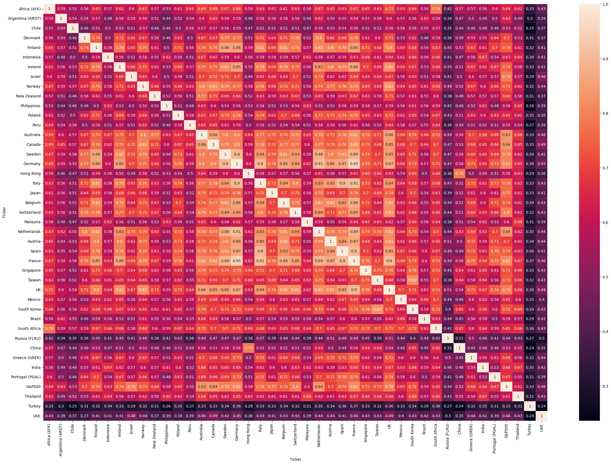
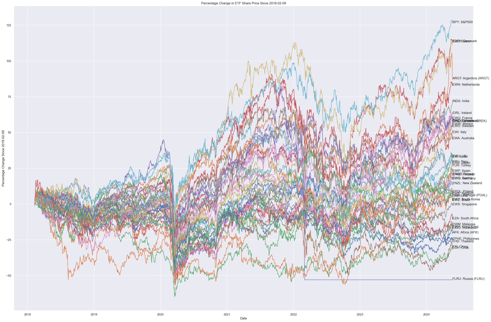
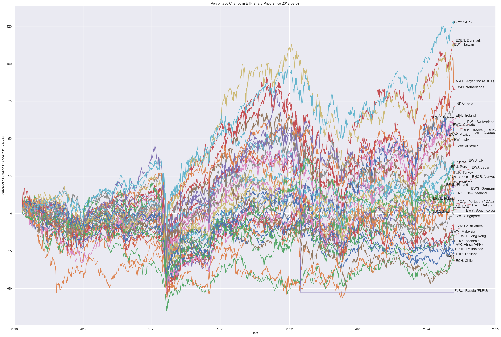
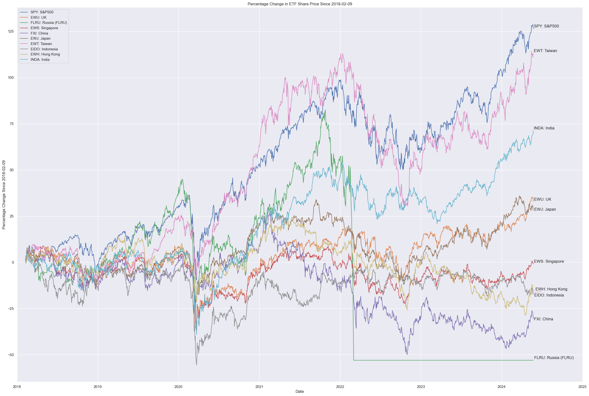

```python
import yfinance as yf
import pandas as pd
import numpy as np
from adjustText import adjust_text
# from pandas_datareader.data import DataReader # conda install pandas-datareader

import matplotlib.pyplot as plt
import seaborn as sns
```


```python
tickers = ['EWO', 'EWK', 'EDEN', 'EFNL', 'EWQ',
            'EWG', 'GREK', 'EIRL', 'EWI', 'EWN',
            'ENOR', 'PGAL', 'EWP', 'EWD', 'EWL',
            'EWU', 'EWJ', 'EWA', 'EWS', 'EWH',
            'EWY', 'ENZL', 'EWC', 'FXI', 'INDA',
            'EIDO', 'EWM', 'EPHE', 'EWT', 'THD',
            'ARGT', 'EWZ', 'ECH', 'EWW', 'EPU',
            'EPOL', 'FLRU', 'TUR',
            'EIS', 'AFK', 'EZA', 'UAE',
            'SPY']

labels = ['Austria', 'Belgium', 'Denmark', 'Finland', 'France',
        'Germany', 'Greece (GREK)', 'Ireland', 'Italy', 'Netherlands',
        'Norway', 'Portugal (PGAL)', 'Spain', 'Sweden', 'Switzerland', 
        'UK', 'Japan', 'Australia', 'Singapore', 'Hong Kong', 
        'South Korea', 'New Zealand', 'Canada', 'China', 'India', 
        'Indonesia', 'Malaysia', 'Philippines', 'Taiwan', 'Thailand',
        'Argentina (ARGT)', 'Brazil', 'Chile', 'Mexico', 'Peru', 
        'Poland', 'Russia (FLRU)', 'Turkey',
        'Israel', 'Africa (AFK)', 'South Africa', 'UAE',
        'S&P500']
```


```python
df = yf.download(tickers, start = '2012-05-24', end='2024-05-24', interval='1d')
```

    [*********************100%%**********************]  43 of 43 completed


```python
df['Adj Close']
```


<div>
<style scoped>
    .dataframe tbody tr th:only-of-type {
        vertical-align: middle;
    }

    .dataframe tbody tr th {
        vertical-align: top;
    }

    .dataframe thead th {
        text-align: right;
    }
</style>
<table border="1" class="dataframe">
  <thead>
    <tr style="text-align: right;">
      <th>Ticker</th>
      <th>AFK</th>
      <th>ARGT</th>
      <th>ECH</th>
      <th>EDEN</th>
      <th>EFNL</th>
      <th>EIDO</th>
      <th>EIRL</th>
      <th>EIS</th>
      <th>ENOR</th>
      <th>ENZL</th>
      <th>...</th>
      <th>EZA</th>
      <th>FLRU</th>
      <th>FXI</th>
      <th>GREK</th>
      <th>INDA</th>
      <th>PGAL</th>
      <th>SPY</th>
      <th>THD</th>
      <th>TUR</th>
      <th>UAE</th>
    </tr>
    <tr>
      <th>Date</th>
      <th></th>
      <th></th>
      <th></th>
      <th></th>
      <th></th>
      <th></th>
      <th></th>
      <th></th>
      <th></th>
      <th></th>
      <th></th>
      <th></th>
      <th></th>
      <th></th>
      <th></th>
      <th></th>
      <th></th>
      <th></th>
      <th></th>
      <th></th>
      <th></th>
    </tr>
  </thead>
  <tbody>
    <tr>
      <th>2012-05-24</th>
      <td>19.112631</td>
      <td>14.197544</td>
      <td>42.777069</td>
      <td>23.101212</td>
      <td>14.893149</td>
      <td>23.199846</td>
      <td>17.140942</td>
      <td>30.996590</td>
      <td>17.131336</td>
      <td>18.754997</td>
      <td>...</td>
      <td>39.001202</td>
      <td>NaN</td>
      <td>24.011021</td>
      <td>23.405497</td>
      <td>18.180611</td>
      <td>NaN</td>
      <td>106.205910</td>
      <td>48.415710</td>
      <td>32.765827</td>
      <td>NaN</td>
    </tr>
    <tr>
      <th>2012-05-25</th>
      <td>19.092075</td>
      <td>14.321771</td>
      <td>42.980042</td>
      <td>23.101212</td>
      <td>14.893149</td>
      <td>21.830355</td>
      <td>17.191378</td>
      <td>30.898415</td>
      <td>17.131336</td>
      <td>18.702864</td>
      <td>...</td>
      <td>38.769794</td>
      <td>NaN</td>
      <td>23.893677</td>
      <td>22.729876</td>
      <td>18.180611</td>
      <td>NaN</td>
      <td>105.861298</td>
      <td>48.334873</td>
      <td>32.910454</td>
      <td>NaN</td>
    </tr>
    <tr>
      <th>2012-05-29</th>
      <td>19.133186</td>
      <td>14.410508</td>
      <td>43.197510</td>
      <td>23.101212</td>
      <td>14.893149</td>
      <td>22.319460</td>
      <td>17.435169</td>
      <td>30.996590</td>
      <td>17.131336</td>
      <td>18.898365</td>
      <td>...</td>
      <td>39.432739</td>
      <td>NaN</td>
      <td>24.847076</td>
      <td>24.105251</td>
      <td>18.547888</td>
      <td>NaN</td>
      <td>107.143486</td>
      <td>49.525589</td>
      <td>33.763771</td>
      <td>NaN</td>
    </tr>
    <tr>
      <th>2012-05-30</th>
      <td>18.674049</td>
      <td>13.895846</td>
      <td>42.646584</td>
      <td>23.101212</td>
      <td>14.590578</td>
      <td>22.205338</td>
      <td>17.031662</td>
      <td>30.775713</td>
      <td>17.131336</td>
      <td>18.624662</td>
      <td>...</td>
      <td>38.294476</td>
      <td>NaN</td>
      <td>24.414379</td>
      <td>22.922916</td>
      <td>18.023203</td>
      <td>NaN</td>
      <td>105.588814</td>
      <td>48.452469</td>
      <td>33.098480</td>
      <td>NaN</td>
    </tr>
    <tr>
      <th>2012-05-31</th>
      <td>18.900192</td>
      <td>13.753871</td>
      <td>43.168510</td>
      <td>23.101212</td>
      <td>14.335074</td>
      <td>21.871120</td>
      <td>16.998028</td>
      <td>30.947514</td>
      <td>16.764442</td>
      <td>18.748482</td>
      <td>...</td>
      <td>38.944916</td>
      <td>NaN</td>
      <td>24.561064</td>
      <td>23.405497</td>
      <td>18.189356</td>
      <td>NaN</td>
      <td>105.356453</td>
      <td>48.768520</td>
      <td>33.423882</td>
      <td>NaN</td>
    </tr>
    <tr>
      <th>...</th>
      <td>...</td>
      <td>...</td>
      <td>...</td>
      <td>...</td>
      <td>...</td>
      <td>...</td>
      <td>...</td>
      <td>...</td>
      <td>...</td>
      <td>...</td>
      <td>...</td>
      <td>...</td>
      <td>...</td>
      <td>...</td>
      <td>...</td>
      <td>...</td>
      <td>...</td>
      <td>...</td>
      <td>...</td>
      <td>...</td>
      <td>...</td>
    </tr>
    <tr>
      <th>2024-05-17</th>
      <td>15.880000</td>
      <td>64.000000</td>
      <td>29.230000</td>
      <td>127.779999</td>
      <td>38.500000</td>
      <td>21.299999</td>
      <td>70.160004</td>
      <td>61.250000</td>
      <td>25.370001</td>
      <td>45.889999</td>
      <td>...</td>
      <td>43.889999</td>
      <td>NaN</td>
      <td>29.330000</td>
      <td>42.910000</td>
      <td>52.970001</td>
      <td>NaN</td>
      <td>529.450012</td>
      <td>60.529999</td>
      <td>43.150002</td>
      <td>14.38</td>
    </tr>
    <tr>
      <th>2024-05-20</th>
      <td>16.070000</td>
      <td>64.769997</td>
      <td>29.510000</td>
      <td>128.029999</td>
      <td>38.380001</td>
      <td>20.900000</td>
      <td>69.889999</td>
      <td>62.330002</td>
      <td>25.350000</td>
      <td>45.189999</td>
      <td>...</td>
      <td>44.139999</td>
      <td>NaN</td>
      <td>29.010000</td>
      <td>43.290001</td>
      <td>53.119999</td>
      <td>NaN</td>
      <td>530.059998</td>
      <td>60.250000</td>
      <td>43.570000</td>
      <td>14.29</td>
    </tr>
    <tr>
      <th>2024-05-21</th>
      <td>16.350000</td>
      <td>63.840000</td>
      <td>29.389999</td>
      <td>127.750000</td>
      <td>38.389999</td>
      <td>20.580000</td>
      <td>69.730003</td>
      <td>62.500000</td>
      <td>25.480000</td>
      <td>45.299999</td>
      <td>...</td>
      <td>44.389999</td>
      <td>NaN</td>
      <td>28.559999</td>
      <td>43.200001</td>
      <td>53.209999</td>
      <td>NaN</td>
      <td>531.359985</td>
      <td>59.279999</td>
      <td>44.139999</td>
      <td>14.33</td>
    </tr>
    <tr>
      <th>2024-05-22</th>
      <td>15.960000</td>
      <td>60.939999</td>
      <td>28.799999</td>
      <td>126.849998</td>
      <td>38.099998</td>
      <td>20.540001</td>
      <td>69.720001</td>
      <td>61.840000</td>
      <td>25.200001</td>
      <td>44.840000</td>
      <td>...</td>
      <td>43.419998</td>
      <td>NaN</td>
      <td>28.200001</td>
      <td>41.939999</td>
      <td>53.290001</td>
      <td>NaN</td>
      <td>529.830017</td>
      <td>59.090000</td>
      <td>44.029999</td>
      <td>14.27</td>
    </tr>
    <tr>
      <th>2024-05-23</th>
      <td>15.550000</td>
      <td>58.919998</td>
      <td>29.020000</td>
      <td>126.940002</td>
      <td>37.849998</td>
      <td>20.400000</td>
      <td>69.860001</td>
      <td>61.380001</td>
      <td>25.219999</td>
      <td>45.139999</td>
      <td>...</td>
      <td>42.500000</td>
      <td>NaN</td>
      <td>27.629999</td>
      <td>42.020000</td>
      <td>53.810001</td>
      <td>NaN</td>
      <td>525.960022</td>
      <td>58.240002</td>
      <td>43.459999</td>
      <td>14.00</td>
    </tr>
  </tbody>
</table>
<p>3019 rows × 43 columns</p>
</div>


```python
df_pct = df['Adj Close'].pct_change().dropna()

df_pct
```


<div>
<style scoped>
    .dataframe tbody tr th:only-of-type {
        vertical-align: middle;
    }

    .dataframe tbody tr th {
        vertical-align: top;
    }

    .dataframe thead th {
        text-align: right;
    }
</style>
<table border="1" class="dataframe">
  <thead>
    <tr style="text-align: right;">
      <th>Ticker</th>
      <th>AFK</th>
      <th>ARGT</th>
      <th>ECH</th>
      <th>EDEN</th>
      <th>EFNL</th>
      <th>EIDO</th>
      <th>EIRL</th>
      <th>EIS</th>
      <th>ENOR</th>
      <th>ENZL</th>
      <th>...</th>
      <th>EZA</th>
      <th>FLRU</th>
      <th>FXI</th>
      <th>GREK</th>
      <th>INDA</th>
      <th>PGAL</th>
      <th>SPY</th>
      <th>THD</th>
      <th>TUR</th>
      <th>UAE</th>
    </tr>
    <tr>
      <th>Date</th>
      <th></th>
      <th></th>
      <th></th>
      <th></th>
      <th></th>
      <th></th>
      <th></th>
      <th></th>
      <th></th>
      <th></th>
      <th></th>
      <th></th>
      <th></th>
      <th></th>
      <th></th>
      <th></th>
      <th></th>
      <th></th>
      <th></th>
      <th></th>
      <th></th>
    </tr>
  </thead>
  <tbody>
    <tr>
      <th>2018-02-09</th>
      <td>0.002876</td>
      <td>-0.013185</td>
      <td>-0.002837</td>
      <td>0.006739</td>
      <td>0.007935</td>
      <td>0.024381</td>
      <td>0.005867</td>
      <td>0.000804</td>
      <td>0.001956</td>
      <td>0.004301</td>
      <td>...</td>
      <td>0.028860</td>
      <td>0.000000</td>
      <td>0.001520</td>
      <td>0.008704</td>
      <td>0.030904</td>
      <td>0.006803</td>
      <td>0.015021</td>
      <td>0.029687</td>
      <td>0.020115</td>
      <td>0.002345</td>
    </tr>
    <tr>
      <th>2018-02-12</th>
      <td>0.022532</td>
      <td>0.038895</td>
      <td>0.009862</td>
      <td>0.019930</td>
      <td>0.011562</td>
      <td>0.010850</td>
      <td>0.011234</td>
      <td>0.013055</td>
      <td>0.024990</td>
      <td>0.001285</td>
      <td>...</td>
      <td>0.030011</td>
      <td>0.000000</td>
      <td>0.012359</td>
      <td>0.012464</td>
      <td>0.005091</td>
      <td>0.008446</td>
      <td>0.014685</td>
      <td>0.009610</td>
      <td>0.022535</td>
      <td>0.000819</td>
    </tr>
    <tr>
      <th>2018-02-13</th>
      <td>0.008814</td>
      <td>0.005716</td>
      <td>-0.005071</td>
      <td>-0.001939</td>
      <td>0.001459</td>
      <td>0.018006</td>
      <td>0.006623</td>
      <td>-0.009318</td>
      <td>0.006857</td>
      <td>0.005988</td>
      <td>...</td>
      <td>0.018301</td>
      <td>0.008861</td>
      <td>0.000000</td>
      <td>0.002841</td>
      <td>-0.000563</td>
      <td>-0.002513</td>
      <td>0.002488</td>
      <td>0.008691</td>
      <td>-0.004821</td>
      <td>0.004441</td>
    </tr>
    <tr>
      <th>2018-02-14</th>
      <td>0.019857</td>
      <td>0.030122</td>
      <td>0.017931</td>
      <td>0.018682</td>
      <td>0.023312</td>
      <td>0.008503</td>
      <td>0.006579</td>
      <td>0.020212</td>
      <td>0.007189</td>
      <td>0.014456</td>
      <td>...</td>
      <td>0.038246</td>
      <td>0.005019</td>
      <td>0.030413</td>
      <td>0.017941</td>
      <td>0.005068</td>
      <td>0.020982</td>
      <td>0.013496</td>
      <td>0.009334</td>
      <td>0.007151</td>
      <td>0.001163</td>
    </tr>
    <tr>
      <th>2018-02-15</th>
      <td>0.023754</td>
      <td>0.013793</td>
      <td>0.019284</td>
      <td>0.010710</td>
      <td>0.011628</td>
      <td>0.009781</td>
      <td>0.019819</td>
      <td>0.012554</td>
      <td>0.009016</td>
      <td>0.005867</td>
      <td>...</td>
      <td>0.039745</td>
      <td>0.028714</td>
      <td>0.025982</td>
      <td>0.015770</td>
      <td>0.006723</td>
      <td>0.005765</td>
      <td>0.012760</td>
      <td>0.008537</td>
      <td>0.024966</td>
      <td>-0.005811</td>
    </tr>
    <tr>
      <th>...</th>
      <td>...</td>
      <td>...</td>
      <td>...</td>
      <td>...</td>
      <td>...</td>
      <td>...</td>
      <td>...</td>
      <td>...</td>
      <td>...</td>
      <td>...</td>
      <td>...</td>
      <td>...</td>
      <td>...</td>
      <td>...</td>
      <td>...</td>
      <td>...</td>
      <td>...</td>
      <td>...</td>
      <td>...</td>
      <td>...</td>
      <td>...</td>
    </tr>
    <tr>
      <th>2024-05-17</th>
      <td>-0.006879</td>
      <td>0.005183</td>
      <td>0.008279</td>
      <td>-0.002420</td>
      <td>0.002865</td>
      <td>0.013321</td>
      <td>0.000143</td>
      <td>-0.001304</td>
      <td>0.004753</td>
      <td>0.007686</td>
      <td>...</td>
      <td>0.004348</td>
      <td>0.000000</td>
      <td>0.005830</td>
      <td>0.007041</td>
      <td>0.008376</td>
      <td>0.000000</td>
      <td>0.001438</td>
      <td>0.011024</td>
      <td>0.033286</td>
      <td>0.004190</td>
    </tr>
    <tr>
      <th>2024-05-20</th>
      <td>0.011965</td>
      <td>0.012031</td>
      <td>0.009579</td>
      <td>0.001956</td>
      <td>-0.003117</td>
      <td>-0.018779</td>
      <td>-0.003848</td>
      <td>0.017633</td>
      <td>-0.000788</td>
      <td>-0.015254</td>
      <td>...</td>
      <td>0.005696</td>
      <td>0.000000</td>
      <td>-0.010910</td>
      <td>0.008856</td>
      <td>0.002832</td>
      <td>0.000000</td>
      <td>0.001152</td>
      <td>-0.004626</td>
      <td>0.009733</td>
      <td>-0.006259</td>
    </tr>
    <tr>
      <th>2024-05-21</th>
      <td>0.017424</td>
      <td>-0.014358</td>
      <td>-0.004066</td>
      <td>-0.002187</td>
      <td>0.000261</td>
      <td>-0.015311</td>
      <td>-0.002289</td>
      <td>0.002727</td>
      <td>0.005128</td>
      <td>0.002434</td>
      <td>...</td>
      <td>0.005664</td>
      <td>0.000000</td>
      <td>-0.015512</td>
      <td>-0.002079</td>
      <td>0.001694</td>
      <td>0.000000</td>
      <td>0.002453</td>
      <td>-0.016100</td>
      <td>0.013082</td>
      <td>0.002799</td>
    </tr>
    <tr>
      <th>2024-05-22</th>
      <td>-0.023853</td>
      <td>-0.045426</td>
      <td>-0.020075</td>
      <td>-0.007045</td>
      <td>-0.007554</td>
      <td>-0.001944</td>
      <td>-0.000143</td>
      <td>-0.010560</td>
      <td>-0.010989</td>
      <td>-0.010155</td>
      <td>...</td>
      <td>-0.021852</td>
      <td>0.000000</td>
      <td>-0.012605</td>
      <td>-0.029167</td>
      <td>0.001504</td>
      <td>0.000000</td>
      <td>-0.002879</td>
      <td>-0.003205</td>
      <td>-0.002492</td>
      <td>-0.004187</td>
    </tr>
    <tr>
      <th>2024-05-23</th>
      <td>-0.025689</td>
      <td>-0.033147</td>
      <td>0.007639</td>
      <td>0.000710</td>
      <td>-0.006562</td>
      <td>-0.006816</td>
      <td>0.002008</td>
      <td>-0.007439</td>
      <td>0.000794</td>
      <td>0.006690</td>
      <td>...</td>
      <td>-0.021188</td>
      <td>0.000000</td>
      <td>-0.020213</td>
      <td>0.001908</td>
      <td>0.009758</td>
      <td>0.000000</td>
      <td>-0.007304</td>
      <td>-0.014385</td>
      <td>-0.012946</td>
      <td>-0.018921</td>
    </tr>
  </tbody>
</table>
<p>1582 rows × 43 columns</p>
</div>


```python
cols_dict = dict(zip(tickers, labels))

cols_dict
```


    {'EWO': 'Austria',
     'EWK': 'Belgium',
     'EDEN': 'Denmark',
     'EFNL': 'Finland',
     'EWQ': 'France',
     'EWG': 'Germany',
     'GREK': 'Greece (GREK)',
     'EIRL': 'Ireland',
     'EWI': 'Italy',
     'EWN': 'Netherlands',
     'ENOR': 'Norway',
     'PGAL': 'Portugal (PGAL)',
     'EWP': 'Spain',
     'EWD': 'Sweden',
     'EWL': 'Switzerland',
     'EWU': 'UK',
     'EWJ': 'Japan',
     'EWA': 'Australia',
     'EWS': 'Singapore',
     'EWH': 'Hong Kong',
     'EWY': 'South Korea',
     'ENZL': 'New Zealand',
     'EWC': 'Canada',
     'FXI': 'China',
     'INDA': 'India',
     'EIDO': 'Indonesia',
     'EWM': 'Malaysia',
     'EPHE': 'Philippines',
     'EWT': 'Taiwan',
     'THD': 'Thailand',
     'ARGT': 'Argentina (ARGT)',
     'EWZ': 'Brazil',
     'ECH': 'Chile',
     'EWW': 'Mexico',
     'EPU': 'Peru',
     'EPOL': 'Poland',
     'FLRU': 'Russia (FLRU)',
     'TUR': 'Turkey',
     'EIS': 'Israel',
     'AFK': 'Africa (AFK)',
     'EZA': 'South Africa',
     'UAE': 'UAE',
     'SPY': 'S&P500'}


```python
corr = df_pct.rename(columns = cols_dict).corr()

fig, ax = plt.subplots(figsize = (30,20))

sns.heatmap(corr, ax = ax, annot=True)
```


    <AxesSubplot: xlabel='Ticker', ylabel='Ticker'>





```python
df1 = pd.DataFrame([[0,1,2,3],
                    [4,5,6,7],
                    [8,9,10,11],
                    [12,13,14,15]], columns = ['A', 'B', 'C', 'D'])

s = df1.iloc[0]

(df1+1)*s
```


<div>
<style scoped>
    .dataframe tbody tr th:only-of-type {
        vertical-align: middle;
    }

    .dataframe tbody tr th {
        vertical-align: top;
    }

    .dataframe thead th {
        text-align: right;
    }
</style>
<table border="1" class="dataframe">
  <thead>
    <tr style="text-align: right;">
      <th></th>
      <th>A</th>
      <th>B</th>
      <th>C</th>
      <th>D</th>
    </tr>
  </thead>
  <tbody>
    <tr>
      <th>0</th>
      <td>0</td>
      <td>2</td>
      <td>6</td>
      <td>12</td>
    </tr>
    <tr>
      <th>1</th>
      <td>0</td>
      <td>6</td>
      <td>14</td>
      <td>24</td>
    </tr>
    <tr>
      <th>2</th>
      <td>0</td>
      <td>10</td>
      <td>22</td>
      <td>36</td>
    </tr>
    <tr>
      <th>3</th>
      <td>0</td>
      <td>14</td>
      <td>30</td>
      <td>48</td>
    </tr>
  </tbody>
</table>
</div>


```python

```


```python
#growth since 2014
start = df['Adj Close'].iloc[0]

growth = (df_pct+1).cumprod()

growth
```


<div>
<style scoped>
    .dataframe tbody tr th:only-of-type {
        vertical-align: middle;
    }

    .dataframe tbody tr th {
        vertical-align: top;
    }

    .dataframe thead th {
        text-align: right;
    }
</style>
<table border="1" class="dataframe">
  <thead>
    <tr style="text-align: right;">
      <th>Ticker</th>
      <th>AFK</th>
      <th>ARGT</th>
      <th>ECH</th>
      <th>EDEN</th>
      <th>EFNL</th>
      <th>EIDO</th>
      <th>EIRL</th>
      <th>EIS</th>
      <th>ENOR</th>
      <th>ENZL</th>
      <th>...</th>
      <th>EZA</th>
      <th>FLRU</th>
      <th>FXI</th>
      <th>GREK</th>
      <th>INDA</th>
      <th>PGAL</th>
      <th>SPY</th>
      <th>THD</th>
      <th>TUR</th>
      <th>UAE</th>
    </tr>
    <tr>
      <th>Date</th>
      <th></th>
      <th></th>
      <th></th>
      <th></th>
      <th></th>
      <th></th>
      <th></th>
      <th></th>
      <th></th>
      <th></th>
      <th></th>
      <th></th>
      <th></th>
      <th></th>
      <th></th>
      <th></th>
      <th></th>
      <th></th>
      <th></th>
      <th></th>
      <th></th>
    </tr>
  </thead>
  <tbody>
    <tr>
      <th>2018-02-09</th>
      <td>1.002876</td>
      <td>0.986815</td>
      <td>0.997163</td>
      <td>1.006739</td>
      <td>1.007935</td>
      <td>1.024381</td>
      <td>1.005867</td>
      <td>1.000804</td>
      <td>1.001956</td>
      <td>1.004301</td>
      <td>...</td>
      <td>1.028860</td>
      <td>1.000000</td>
      <td>1.001520</td>
      <td>1.008704</td>
      <td>1.030904</td>
      <td>1.006803</td>
      <td>1.015021</td>
      <td>1.029687</td>
      <td>1.020115</td>
      <td>1.002345</td>
    </tr>
    <tr>
      <th>2018-02-12</th>
      <td>1.025472</td>
      <td>1.025198</td>
      <td>1.006997</td>
      <td>1.026804</td>
      <td>1.019588</td>
      <td>1.035496</td>
      <td>1.017166</td>
      <td>1.013869</td>
      <td>1.026995</td>
      <td>1.005591</td>
      <td>...</td>
      <td>1.059736</td>
      <td>1.000000</td>
      <td>1.013898</td>
      <td>1.021277</td>
      <td>1.036152</td>
      <td>1.015306</td>
      <td>1.029927</td>
      <td>1.039583</td>
      <td>1.043104</td>
      <td>1.003165</td>
    </tr>
    <tr>
      <th>2018-02-13</th>
      <td>1.034511</td>
      <td>1.031058</td>
      <td>1.001891</td>
      <td>1.024812</td>
      <td>1.021076</td>
      <td>1.054141</td>
      <td>1.023903</td>
      <td>1.004422</td>
      <td>1.034038</td>
      <td>1.011613</td>
      <td>...</td>
      <td>1.079131</td>
      <td>1.008861</td>
      <td>1.013898</td>
      <td>1.024178</td>
      <td>1.035568</td>
      <td>1.012755</td>
      <td>1.032489</td>
      <td>1.048618</td>
      <td>1.038075</td>
      <td>1.007620</td>
    </tr>
    <tr>
      <th>2018-02-14</th>
      <td>1.055053</td>
      <td>1.062115</td>
      <td>1.019856</td>
      <td>1.043958</td>
      <td>1.044880</td>
      <td>1.063105</td>
      <td>1.030639</td>
      <td>1.024724</td>
      <td>1.041471</td>
      <td>1.026237</td>
      <td>...</td>
      <td>1.120403</td>
      <td>1.013924</td>
      <td>1.044734</td>
      <td>1.042553</td>
      <td>1.040816</td>
      <td>1.034005</td>
      <td>1.046423</td>
      <td>1.058406</td>
      <td>1.045498</td>
      <td>1.008793</td>
    </tr>
    <tr>
      <th>2018-02-15</th>
      <td>1.080115</td>
      <td>1.076765</td>
      <td>1.039523</td>
      <td>1.055139</td>
      <td>1.057030</td>
      <td>1.073503</td>
      <td>1.051065</td>
      <td>1.037588</td>
      <td>1.050861</td>
      <td>1.032258</td>
      <td>...</td>
      <td>1.164934</td>
      <td>1.043038</td>
      <td>1.071879</td>
      <td>1.058994</td>
      <td>1.047813</td>
      <td>1.039966</td>
      <td>1.059776</td>
      <td>1.067441</td>
      <td>1.071600</td>
      <td>1.002931</td>
    </tr>
    <tr>
      <th>...</th>
      <td>...</td>
      <td>...</td>
      <td>...</td>
      <td>...</td>
      <td>...</td>
      <td>...</td>
      <td>...</td>
      <td>...</td>
      <td>...</td>
      <td>...</td>
      <td>...</td>
      <td>...</td>
      <td>...</td>
      <td>...</td>
      <td>...</td>
      <td>...</td>
      <td>...</td>
      <td>...</td>
      <td>...</td>
      <td>...</td>
      <td>...</td>
    </tr>
    <tr>
      <th>2024-05-17</th>
      <td>0.811025</td>
      <td>2.033215</td>
      <td>0.691554</td>
      <td>2.145777</td>
      <td>1.220677</td>
      <td>0.862910</td>
      <td>1.637354</td>
      <td>1.322082</td>
      <td>1.209894</td>
      <td>1.157527</td>
      <td>...</td>
      <td>0.922197</td>
      <td>0.470022</td>
      <td>0.737688</td>
      <td>1.607266</td>
      <td>1.686133</td>
      <td>1.054692</td>
      <td>2.279403</td>
      <td>0.760865</td>
      <td>1.254371</td>
      <td>1.079165</td>
    </tr>
    <tr>
      <th>2024-05-20</th>
      <td>0.820729</td>
      <td>2.057677</td>
      <td>0.698178</td>
      <td>2.149975</td>
      <td>1.216872</td>
      <td>0.846705</td>
      <td>1.631053</td>
      <td>1.345394</td>
      <td>1.208941</td>
      <td>1.139871</td>
      <td>...</td>
      <td>0.927450</td>
      <td>0.470022</td>
      <td>0.729640</td>
      <td>1.621500</td>
      <td>1.690908</td>
      <td>1.054692</td>
      <td>2.282029</td>
      <td>0.757346</td>
      <td>1.266580</td>
      <td>1.072411</td>
    </tr>
    <tr>
      <th>2024-05-21</th>
      <td>0.835029</td>
      <td>2.028132</td>
      <td>0.695339</td>
      <td>2.145273</td>
      <td>1.217189</td>
      <td>0.833741</td>
      <td>1.627319</td>
      <td>1.349063</td>
      <td>1.215140</td>
      <td>1.142645</td>
      <td>...</td>
      <td>0.932703</td>
      <td>0.470022</td>
      <td>0.718322</td>
      <td>1.618129</td>
      <td>1.693773</td>
      <td>1.054692</td>
      <td>2.287626</td>
      <td>0.745153</td>
      <td>1.283150</td>
      <td>1.075413</td>
    </tr>
    <tr>
      <th>2024-05-22</th>
      <td>0.815111</td>
      <td>1.936002</td>
      <td>0.681380</td>
      <td>2.130159</td>
      <td>1.207995</td>
      <td>0.832121</td>
      <td>1.627086</td>
      <td>1.334817</td>
      <td>1.201787</td>
      <td>1.131042</td>
      <td>...</td>
      <td>0.912322</td>
      <td>0.470022</td>
      <td>0.709267</td>
      <td>1.570933</td>
      <td>1.696320</td>
      <td>1.054692</td>
      <td>2.281039</td>
      <td>0.742765</td>
      <td>1.279953</td>
      <td>1.070910</td>
    </tr>
    <tr>
      <th>2024-05-23</th>
      <td>0.794171</td>
      <td>1.871829</td>
      <td>0.686585</td>
      <td>2.131671</td>
      <td>1.200068</td>
      <td>0.826449</td>
      <td>1.630353</td>
      <td>1.324888</td>
      <td>1.202741</td>
      <td>1.138609</td>
      <td>...</td>
      <td>0.892991</td>
      <td>0.470022</td>
      <td>0.694931</td>
      <td>1.573930</td>
      <td>1.712872</td>
      <td>1.054692</td>
      <td>2.264378</td>
      <td>0.732080</td>
      <td>1.263383</td>
      <td>1.050648</td>
    </tr>
  </tbody>
</table>
<p>1582 rows × 43 columns</p>
</div>


```python
sns.set()
fig, ax = plt.subplots(figsize = (30,20))

comb_labels = [f'{key}: {value}' for key, value in cols_dict.items()]

labels_dict = dict(zip(tickers, comb_labels))

ax.plot((growth.rename(columns = labels_dict)-1)*100, label = [f'{key}, {value}' for key, value in cols_dict.items()])

ax.set_title('Percentage Change in ETF Share Price Since 2018-02-09')

ax.set_xlabel('Date')
ax.set_ylabel('Percentage Change Since 2018-02-09')

for name, col in ((growth.rename(columns = labels_dict)-1)*100).items():
    x = col.index[-1]
    y = col.iloc[-1]
    ax.annotate(name, (x,y))
```





```python
sns.set()
fig, ax = plt.subplots(figsize = (30,20))
ax.set_xlim(pd.to_datetime('2018-01-01'), pd.to_datetime('2025-01-01'))

comb_labels = [f'{key}: {value}' for key, value in cols_dict.items()]

labels_dict = dict(zip(tickers, comb_labels))

ax.plot((growth.rename(columns = labels_dict)-1)*100, label = [f'{key}, {value}' for key, value in cols_dict.items()])

p1 = ax.set_title('Percentage Change in ETF Share Price Since 2018-02-09')

ax.set_xlabel('Date')
ax.set_ylabel('Percentage Change Since 2018-02-09')

texts = []

for name, col in ((growth.rename(columns = labels_dict)-1)*100).items():
    x = col.index[-1]
    y = col.iloc[-1]
    texts.append(plt.text(x,y, name))

adjust_text(texts, only_move={'points':'y', 'texts':'y'}, arrowprops=dict(arrowstyle="->", color='r', lw=0.5))


```





```python
df['Adj Close']['SPY']
```


    Date
    2012-05-24    106.205910
    2012-05-25    105.861298
    2012-05-29    107.143486
    2012-05-30    105.588814
    2012-05-31    105.356453
                     ...    
    2024-05-17    529.450012
    2024-05-20    530.059998
    2024-05-21    531.359985
    2024-05-22    529.830017
    2024-05-23    525.960022
    Name: SPY, Length: 3019, dtype: float64


```python
(df_pct['SPY']+1).cumprod()
```


    Date
    2018-02-09    1.015021
    2018-02-12    1.029927
    2018-02-13    1.032489
    2018-02-14    1.046423
    2018-02-15    1.059776
                    ...   
    2024-05-17    2.279403
    2024-05-20    2.282029
    2024-05-21    2.287626
    2024-05-22    2.281039
    2024-05-23    2.264378
    Name: SPY, Length: 1582, dtype: float64


```python
df['Adj Close']['SPY']['2018-02-09']
```


    235.7648162841797


```python
df.to_csv('global_etf_scrape.csv')
df_pct.to_csv('global_etf_pct_change.csv')
growth.to_csv('global_etf_growth.csv')
```


```python
pd.DataFrame(growth.rename(columns = labels_dict).iloc[-1]).sort_values(growth.index[-1], ascending = False)
```


<div>
<style scoped>
    .dataframe tbody tr th:only-of-type {
        vertical-align: middle;
    }

    .dataframe tbody tr th {
        vertical-align: top;
    }

    .dataframe thead th {
        text-align: right;
    }
</style>
<table border="1" class="dataframe">
  <thead>
    <tr style="text-align: right;">
      <th></th>
      <th>2024-05-23</th>
    </tr>
    <tr>
      <th>Ticker</th>
      <th></th>
    </tr>
  </thead>
  <tbody>
    <tr>
      <th>SPY: S&amp;P500</th>
      <td>2.264378</td>
    </tr>
    <tr>
      <th>EDEN: Denmark</th>
      <td>2.131671</td>
    </tr>
    <tr>
      <th>EWT: Taiwan</th>
      <td>2.130588</td>
    </tr>
    <tr>
      <th>ARGT: Argentina (ARGT)</th>
      <td>1.871829</td>
    </tr>
    <tr>
      <th>EWN: Netherlands</th>
      <td>1.827226</td>
    </tr>
    <tr>
      <th>INDA: India</th>
      <td>1.712872</td>
    </tr>
    <tr>
      <th>EIRL: Ireland</th>
      <td>1.630353</td>
    </tr>
    <tr>
      <th>EWQ: France</th>
      <td>1.595333</td>
    </tr>
    <tr>
      <th>EWC: Canada</th>
      <td>1.576364</td>
    </tr>
    <tr>
      <th>EWL: Switzerland</th>
      <td>1.575180</td>
    </tr>
    <tr>
      <th>GREK: Greece (GREK)</th>
      <td>1.573930</td>
    </tr>
    <tr>
      <th>EWW: Mexico</th>
      <td>1.553637</td>
    </tr>
    <tr>
      <th>EWD: Sweden</th>
      <td>1.538840</td>
    </tr>
    <tr>
      <th>EWI: Italy</th>
      <td>1.495588</td>
    </tr>
    <tr>
      <th>EWA: Australia</th>
      <td>1.452609</td>
    </tr>
    <tr>
      <th>EWU: UK</th>
      <td>1.328681</td>
    </tr>
    <tr>
      <th>EIS: Israel</th>
      <td>1.324888</td>
    </tr>
    <tr>
      <th>EPU: Peru</th>
      <td>1.289295</td>
    </tr>
    <tr>
      <th>EWJ: Japan</th>
      <td>1.281468</td>
    </tr>
    <tr>
      <th>TUR: Turkey</th>
      <td>1.263383</td>
    </tr>
    <tr>
      <th>EWP: Spain</th>
      <td>1.225020</td>
    </tr>
    <tr>
      <th>ENOR: Norway</th>
      <td>1.202741</td>
    </tr>
    <tr>
      <th>EFNL: Finland</th>
      <td>1.200068</td>
    </tr>
    <tr>
      <th>EWO: Austria</th>
      <td>1.173536</td>
    </tr>
    <tr>
      <th>EWG: Germany</th>
      <td>1.171883</td>
    </tr>
    <tr>
      <th>ENZL: New Zealand</th>
      <td>1.138609</td>
    </tr>
    <tr>
      <th>EPOL: Poland</th>
      <td>1.081306</td>
    </tr>
    <tr>
      <th>EWK: Belgium</th>
      <td>1.068429</td>
    </tr>
    <tr>
      <th>PGAL: Portugal (PGAL)</th>
      <td>1.054692</td>
    </tr>
    <tr>
      <th>UAE: UAE</th>
      <td>1.050648</td>
    </tr>
    <tr>
      <th>EWY: South Korea</th>
      <td>1.025979</td>
    </tr>
    <tr>
      <th>EWZ: Brazil</th>
      <td>1.021344</td>
    </tr>
    <tr>
      <th>EWS: Singapore</th>
      <td>0.991784</td>
    </tr>
    <tr>
      <th>EZA: South Africa</th>
      <td>0.892991</td>
    </tr>
    <tr>
      <th>EWM: Malaysia</th>
      <td>0.851309</td>
    </tr>
    <tr>
      <th>EWH: Hong Kong</th>
      <td>0.835015</td>
    </tr>
    <tr>
      <th>EIDO: Indonesia</th>
      <td>0.826449</td>
    </tr>
    <tr>
      <th>AFK: Africa (AFK)</th>
      <td>0.794171</td>
    </tr>
    <tr>
      <th>EPHE: Philippines</th>
      <td>0.750118</td>
    </tr>
    <tr>
      <th>THD: Thailand</th>
      <td>0.732080</td>
    </tr>
    <tr>
      <th>FXI: China</th>
      <td>0.694931</td>
    </tr>
    <tr>
      <th>ECH: Chile</th>
      <td>0.686585</td>
    </tr>
    <tr>
      <th>FLRU: Russia (FLRU)</th>
      <td>0.470022</td>
    </tr>
  </tbody>
</table>
</div>


```python
sns.set()
fig, ax = plt.subplots(figsize = (30,20))
ax.set_xlim(pd.to_datetime('2018-01-01'), pd.to_datetime('2025-01-01'))

plot_df = growth.copy()

comb_labels = [f'{key}: {value}' for key, value in cols_dict.items()]

labels_dict = dict(zip(tickers, comb_labels))

for name, series in ((growth.rename(columns = labels_dict)-1)*100)[['SPY: S&P500', 'EWU: UK', 'FLRU: Russia (FLRU)', 'EWS: Singapore', 'FXI: China', 'EWJ: Japan', 'EWT: Taiwan', 'EIDO: Indonesia', 'EWH: Hong Kong', 'INDA: India']].items():
    ax.plot(series, label = name)

ax.set_title('Percentage Change in ETF Share Price Since 2018-02-09')

ax.set_xlabel('Date')
ax.set_ylabel('Percentage Change Since 2018-02-09')

ax.legend()

texts = []

for name, col in ((growth.rename(columns = labels_dict)-1)*100)[['SPY: S&P500', 'EWU: UK', 'FLRU: Russia (FLRU)', 'EWS: Singapore', 'FXI: China', 'EWJ: Japan', 'EWT: Taiwan', 'EIDO: Indonesia', 'EWH: Hong Kong', 'INDA: India']].items():
    x = col.index[-1]
    y = col.iloc[-1]
    texts.append(plt.text(x,y, name))

adjust_text(texts, only_move={'points':'y', 'texts':'y'}, arrowprops=dict(arrowstyle="->", color='r', lw=0.5))


```





```python

```
